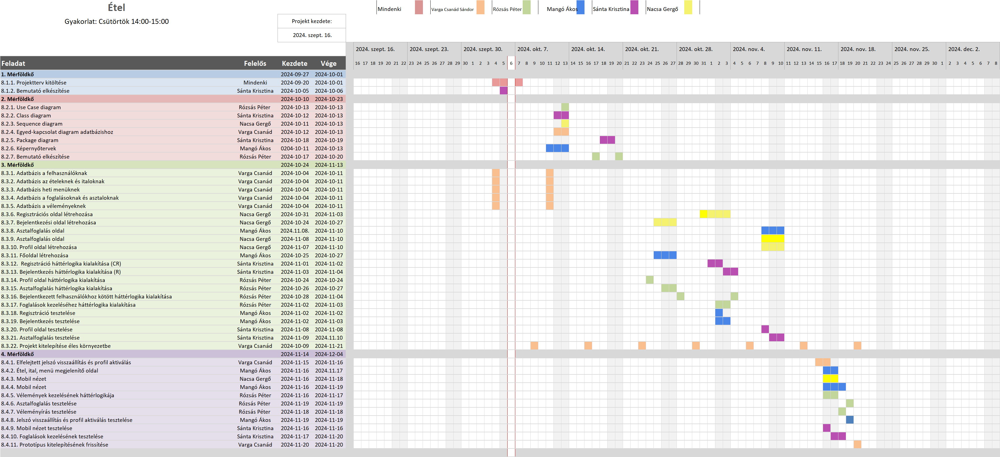

# Étel Projektterv 2024

## 1. Összefoglaló 

Az étteremben töltött ídő minőségét, a vacsoránk élményét nagyban befolyásolja az étterem dolgozóinak vendégszeretete, az étel ízélménye, továbbá a környezet hangulata. Mindez azonban csak a fantáziánkban élhet tovább, ha nincs jól leszervezve a délutáni programunk.
Weboldalunkon lehetővé tesszük, hogy az étel és italkínálatunk megtekintése mellett a megfelelő asztalt lefoglalhassa, a foglalásait kezelhesse, valamint az élményeit, tapasztalatait megossza velünk, hogy a jövőben tovább fejlődhessünk.

## 2. A projekt bemutatása

Ez a projektterv az Étel projektet mutatja be, amely 2024-09-16-tól 2024-12-04-ig tart, azaz összesen 79 napon keresztül fog futni. A projekten öt fejlesztő fog dolgozni, az elvégzett feladatokat pedig négy alkalommal fogjuk prezentálni a megrendelőnek, annak érdekében, hogy biztosítsuk a projekt folyamatos előrehaladását.

### 2.1. Rendszerspecifikáció

A rendszernek képesnek kell lennie az étterem asztalai foglaltsági állapotának ellenőrzésére, valamint azok lefoglalására a felhasználók által. A regisztrált és bejelentkezett felhasználók képesek a meglévő foglalásaik kezelésére, módosítására, valamint a foglalás időtartama után visszajelzés írására, amit az új vendégek a főoldalon meg tudnak tekinteni. Ezen felül meg tudják tekinteni az étel és italkínálatot, valamint az aktuális heti menüt.

### 2.2. Funkcionális követelmények

 - Felhasználók kezelése
 - Felhasználói munkamenet megvalósítása
 - Asztalfoglalások kezelése
 - Vélemények kezelése és dinamikus megjelenítése
 - Elfelejtett jeszó visszaállítása
 - Felhasználói profil aktiválása email-en keresztül

### 2.3. Nem funkcionális követelmények

 - A kliens oldal böngészőfüggetlen legyen
 - Reszponzív megjelenés
 - Az érzékeny adatokat biztonságosan tároljuk
 - Mobilon is megjeleníthető legyen

## 3. Költség- és erőforrás-szükségletek

Az erőforrásigényünk összesen 69 személynap, átlagosan 13.8 személynap/fő.

A rendelkezésünkre áll összesen 5 * 70 = 350 pont.

## 4. Szervezeti felépítés és felelősségmegosztás

A projekt megrendelője Mihály Pál. Az Étel projektet a projektcsapat fogja végrehajtani, amely jelenleg öt fejlesztőből áll. A csapatban található tapasztalt és pályakezdő webprogramozó is. A tapasztalt projekttagok több éve dolgoznak az iparban, számos sikeres projektten vannak túl.
 - Mangó Ferenc Ákos (Harmadéves egyetemista, egyszerű, kiválló design, korábbi webáruházas projekt)
 - Nacsa Gergő (Negyedéves egyetemista, önfejlesztés céljából előállított egyéni projekt, Adatbázis alapú rendszerek kurzuson 3 fős csapatban szerzett kooperatív munkamegosztással együttjáró tapasztalatszerzés)
 - Rózsás Péter (Harmadéves egyetemista, másfél év szakmai tapasztalat tesztelésben, algoritmus írásban. Nagyedéves tapasztalat csapatvezetőként és témavezetőként)
 - Sánta Krisztina Csilla (3 év egyetemi és magánprojekt tapasztalat)
 - Varga Csanád Sándor (2 Szemeszter egyetemi, és 3 év néhai freelance munka tapasztalat)

### 4.1 Projektcsapat

A projekt a következő emberekből áll:

| Név            | Pozíció          |   E-mail cím (stud-os)        |
|----------------|------------------|-------------------------------|
|Sánta Krisztina | Projektmenedzser | h269825@stud.u-szeged.hu      |
| Mangó Ákos     | Projekt tag      | h267428@stud.u-szeged.hu      |
| Nacsa Gergő    | Projekt tag      | h161989@stud.u-szeged.hu      |
| Rózsás Péter   | Projekt tag      | h268942@stud.u-szeged.hu      |
| Varga Csanád   | Projekt tag      | h379029@stud.u-szeged.hu      | 

## 5. A munka feltételei

### 5.1. Munkakörnyezet

A projekt a következő munkaállomásokat fogja használni a munka során:

- Asus Zenbook UX534 I7 8565U, GTX 1650 Mobile Max Design
- Acer Swift 3 SF314-43 laptop (CPU: AMD Ryzen 5 5500U, RAM: 16 GB, GPU: AMD Radeon, OS: Windows 11)
- Lenovo IdeaPad 3 15ALC6 (CPU: AMD Ryzen 5 5500U with Radeon Graphics, RAM: 8 GB DDR4, OS: Windows 11)
- MSI Katana GF76 11UD (CPU: i7-11800H RAM: 16GB GPU: NVIDIA GeForce RTX 3050 Ti Laptop GPU OS: Windows 10 Pro)
- PC (CPU: i5-10400 GPU: GTX970 RAM: 32 GB DDR5, OS: Windows 11)

A projekt a következő technológiákat/szoftvereket fogja használni a munka során: 

 - mySQL adatbázisszerver
 - Node.js-re épülő Express keretrendszer
 - Visual Studio Code
 - Git verziókövető (GitLab)
 - cPanel (Cweb.hu)

### 5.2. Rizikómenedzsment

| Kockázat                                    | Leírás                                                                                                                                                                                     | Valószínűség | Hatás  |
|---------------------------------------------|--------------------------------------------------------------------------------------------------------------------------------------------------------------------------------------------|--------------|--------|
| Betegség                                  | Súlyosságtól függően hátráltatja vagy bizonyos esetekben teljes mértékben korlátozza a munkavégzőt, így az egész projektre kihatással van. Megoldás: a feladatok átcsoportosítása        | közepes       | erős |
| Kommunikációs fennakadás a csapattagokkal | A csapattagok között nem elégséges az információ áramlás, nem pontosan, esetleg késve vagy nem egyértelműen tájékoztatjuk egymást. Megoldás: még gyakoribb megbeszélések és ellenőrzések | kis        | erős |
| Hirtelen sok zh | A mennyiségtől és a tantárgyak nehézségétől függően több/kevesebb időre hátráltatja a munkavégzőt. Megoldás: feladatok átcsoportosítása | közepes | erős |
| Szoftver-hardver problémák | Ez a probléma, mivel kifejezetten a munkaeszközön jelentkezik, teljesen megakaszthatja a munkavégzőt. Megoldás: segítség a csapattagnak, feladatok átszervezése. | kis | erős |
 

## 6. Jelentések

### 6.1. Munka menedzsment
A munkát Sánta Krisztina koordinálja. Fő feladata, hogy folyamatosan egyeztessen a csapattagokkal az előrehaladásról és a fellépő problémákról, esetlegesen a megoldásban is segítséget nyújhat a projekt csúszásának elkerülése végett. További feladata a heti szinten tartandó csoportgyűlések időpontjának és helyszínének leszervezése, erről Discordon tájékoztatja a projektcsapatot.

### 6.2. Csoportgyűlések

A projekt hetente ülésezik, hogy megvitassák az azt megelőző hét problémáit, illetve hogy megbeszéljék a következő hét feladatait. A megbeszélésről minden esetben memó készül.

1. megbeszélés:
 - Időpont: 2024.09.22.
 - Hely: online
 - Résztvevők: Nacsa Gergő, Sánta Krisztina, Rózsás Péter, Varga Csanád
 - Érintett témák: Ismerkedés, projekttéma kiválasztása, projektvezető megválasztása, ötletek felvázolása

2. megbeszélés:
 - Időpont: 2024.09.27.
 - Hely: online
 - Résztvevők: Mangó Ferenc, Nacsa Gergő, Sánta Krisztina, Varga Csanád
 - Érintett témák: A projektben használt technológiák rögzítése, a projektterv áttekintése, szerepkörök és vállalások kiosztása

3. megbeszélés:
- Időpont: 2024.10.06.
- Hely: online
- Résztvevők: Mangó Ferenc, Nacsa Gergő, Rózsás Péter,  Sánta Krisztina, Varga Csanád
- Érintett témák: A feladatok végső elosztásának és a projektterv végső rögzítése

### 6.3. Minőségbiztosítás

Az elkészült terveket a terveken nem dolgozó csapattársak közül átnézik, hogy megfelel-e a specifikációnak és az egyes diagramtípusok összhangban vannak-e egymással. A meglévő rendszerünk helyes működését a prototípusok bemutatása előtt a tesztelési dokumentumban leírtak végrehajtása alapján ellenőrizzük és összevetjük a specifikációval, hogy az elvárt eredményt kapjuk-e. További tesztelési lehetőségek: unit tesztek írása az egyes modulokhoz vagy a kód közös átnézése (code review) egy, a vizsgált modul programozásában nem résztvevő csapattaggal. Szoftverünk minőségét a végső leadás előtt javítani kell a rendszerünkre lefuttatott kódelemzés során kapott metrikaértékek és szabálysértések figyelembevételével.
Az alábbi lehetőségek vannak a szoftver megfelelő minőségének biztosítására:
- Specifikáció és tervek átnézése (kötelező)
- Teszttervek végrehajtása (kötelező)
- Unit tesztek írása (választható)
- Kód átnézése (választható)

### 6.4. Átadás, eredmények elfogadása

A projekt eredményeit a megrendelő, Mihály Pál fogja elfogadni. A projektterven változásokat csak a megrendelő írásos engedélyével lehet tenni. A projekt eredményesnek bizonyul, ha specifikáció helyes és határidőn belül készül el. Az esetleges késések pontlevonást eredményeznek. 
Az elfogadás feltételeire és beadás formájára vonatkozó részletes leírás a következő honlapon olvasható: https://okt.inf.szte.hu/rf1/

### 6.5. Státuszjelentés

Minden mérföldkő leadásnál a projekten dolgozók jelentést tesznek a mérföldkőben végzett munkájukról a a megadott sablon alapján. A gyakorlatvezetővel folytatott csapatmegbeszéléseken a csapat áttekintik és felmérik az eredményeket és teendőket. Továbbá gazdálkodnak az erőforrásokkal és szükség esetén a megrendelővel egyeztetnek a projektterv módosításáról.

## 7. A munka tartalma

### 7.1. Tervezett szoftverfolyamat modell és architektúra

A szoftver fejlesztése során az agilis fejlesztési modellt alkalmazzuk, mivel a fejlesztés során nagy hangsúlyt fektetünk a folyamatos kommunikcióra. A fejlesztés során a szoftver specifikációi rugalmasan vátozhatnak, és ezzel a módszertannal tudunk a leggyorsabban alkalmazkodni az új elvárásokhoz.

A webalkalmazás az MVC (modell-view-controller) felépítést követi, a szerver és a kliens függetlenek, csupán API végpontok segítségével kommunikálnak.

### 7.2. Átadandók és határidők

A főbb átadandók és határidők a projekt időtartama alatt a következők:

| Szállítandó |                 Neve                                                        |   Határideje  |
|:-----------:|:---------------------------------------------------------------------------:|:-------------:|
|      D1     |      Projektterv és Gantt chart, prezentáció, egyéni jelentés               | 2024-10-09  |
|    P1+D2    |      UML, adatbázis- és képernyőtervek, prezentáció, egyéni jelentés        | 2024-10-23  |
|    P1+D3    |      Prototípus I. és tesztelési dokumentáció, egyéni jelentés              | 2024-11-13  |
|    P2+D4    |      Prototípus II. és frissített tesztelési dokumentáció, egyéni jelentés  | 2024-12-04  |

## 8. Feladatlista

A következőkben a tervezett feladatok részletes összefoglalása található.

### 8.1. Projektterv (1. mérföldkő)

Ennek a feladatnak az a célja, hogy megvalósításhoz szükséges lépéseket, az erőforrásigényeket, az ütemezést, a felelősöket és a feladatok sorrendjét meghatározzuk, majd vizualizáljuk Gantt diagram segítségével.

Részfeladatai a következők:

#### 8.1.1. Projektterv kitöltése

Felelős: Mindenki

Tartam:  5 nap

Erőforrásigény:  1 személynap/fő

#### 8.1.2. Bemutató elkészítése

Felelős: Sánta Krisztina Csilla

Tartam:  2 nap

Erőforrásigény:  0.5 személynap

### 8.2. UML és adatbázis- és képernyőtervek (2. mérföldkő)

Ennek a feladatnak az a célja, hogy a rendszerarchitektúrát, az adatbázist és webalkalmazás kinézetét megtervezzük.

Részfeladatai a következők:

#### 8.2.1. Use Case diagram

Felelős: Rózsás Péter

Tartam:  1 nap

Erőforrásigény:  1 személynap

#### 8.2.2. Class diagram

Felelős: Sánta Krisztina Csilla

Tartam:  2 nap

Erőforrásigény:  1 személynap

#### 8.2.3. Sequence diagram

Felelős: Nacsa Gergő

Tartam:  3 nap

Erőforrásigény:  1 személynap

#### 8.2.4. Egyed-kapcsolat diagram adatbázishoz

Felelős: Varga Csanád Sándor

Tartam:  3 nap

Erőforrásigény:  2 személynap

#### 8.2.5. Package diagram

Felelős: Sánta Krisztina Csilla

Tartam:  2 nap

Erőforrásigény:  1 szeméylnap

#### 8.2.6. Képernyőtervek

Felelős: Mangó Ferenc Ákos

Tartam:  3 nap

Erőforrásigény:  2 személynap

#### 8.2.7. Bemutató elkészítése

Felelős: Rózsás Péter

Tartam:  2 nap

Erőforrásigény:  1.5 személynap

### 8.3. Prototípus I. (3. mérföldkő)

Ennek a feladatnak az a célja, hogy egy működő prototípust hozzunk létre, ahol a vállalt funkcionális követelmények nagy része már prezentálható állapotban van. 

Részfeladatai a következők:

#### 8.3.1. Adatbázis a Felhasználóknak

Felelős: Varga Csanád Sándor

Tartam:  5 nap

Erőforrásigény:  2 személynap

#### 8.3.2. Adatbázis az ételeknek és italoknak

Felelős: Varga Csanád Sándor

Tartam:  4 nap

Erőforrásigény:  2 személynap

#### 8.3.3. Adatbázis a heti menüknek

Felelős: Varga Csanád Sándor

Tartam:  3 nap

Erőforrásigény:  1 személynap

#### 8.3.4. Adatbázis a foglalásoknak és asztaloknak

Felelős: Varga Csanád Sándor

Tartam:  10 nap

Erőforrásigény:  2 személynap

#### 8.3.5. Adatbázis a véleményeknek

Felelős: Varga Csanád Sándor

Tartam:  3 nap

Erőforrásigény:  1 személynap

#### 8.3.6. Regisztrációs oldal létrehozása

Felelős: Nacsa Gergő

Tartam:  4 nap

Erőforrásigény:  4 személynap

#### 8.3.7. Bejelentkezési oldal létrehozása

Felelős: Nacsa Gergő

Tartam:  4 nap

Erőforrásigény:  2 személynap

#### 8.3.8. Asztalfoglalás oldal létrehozása

Felelős: Mangó Ferenc Ákos

Tartam:  3 nap

Erőforrásigény:  2 személynap

#### 8.3.9. Főoldal létrehozása

Felelős: Nacsa Gergő

Tartam:  3 nap

Erőforrásigény:  2 személynap

#### 8.3.10. Profil oldal létrehozása

Felelős: Nacsa Gergő

Tartam:  4 nap

Erőforrásigény:  3 személynap

#### 8.3.11. Főoldal létrehozása

Felelős: Mangó Ferenc Ákos

Tartam:  5 nap

Erőforrásigény:  3 személynap

#### 8.3.12. Regisztráció háttérlogika kialakítása

Felelős: Sánta Krisztina Csilla

Tartam:  2 nap

Erőforrásigény:  2 személynap

#### 8.3.13. Bejelentkezés háttérlogika kialakítása

Felelős: Sánta Krisztina Csilla

Tartam:  2 nap

Erőforrásigény:  2 személynap

#### 8.3.14. Profil oldal háttérlogika kialakítása

Felelős: Rózsás Péter

Tartam:  1 nap

Erőforrásigény:  1 személynap

#### 8.3.15. Asztalfoglalás háttérlogika kialakítása

Felelős: Rózsás Péter

Tartam:  2 nap

Erőforrásigény:  1.5 személynap

#### 8.3.16. Bejelentkezett felhasználókhoz kötött háttérlogika kialakítása

Felelős: Rózsás Péter

Tartam:  2 nap

Erőforrásigény:  1 személynap

#### 8.3.17. Foglalások kezeléséhez háttérlogika kialakítása

Felelős: Rózsás Péter

Tartam:  2 nap

Erőforrásigény:  2 személynap

#### 8.3.18. Regisztráció tesztelése

Felelős: Mangó Ferenc Ákos

Tartam:  4 nap

Erőforrásigény:  2 személynap

#### 8.3.19. Bejelentkezés tesztelése

Felelős: Mangó Ferenc Ákos

Tartam:  2 nap

Erőforrásigény:  1 személynap

#### 8.3.20. Profil oldal tesztelése

Felelős: Sánta Krisztina Csilla

Tartam:  1 nap

Erőforrásigény:  1 szeméylnap

#### 8.3.21.  Asztalfoglalás tesztelése

Felelős: Sánta Krisztina Csilla

Tartam:  2 nap

Erőforrásigény:  2 személynap

#### 8.3.22.  Projekt kitelepítése éles környezetbe

Felelős: Varga Csanád Sándor

Tartam: 1 nap

Erőforrásigény: 1/4 személynap

### 8.4. Prototípus II. (4. mérföldkő)

Ennek a feladatnak az a célja, hogy az előző mérföldkő hiányzó funkcióit pótoljuk, illetve a hibásan működő funkciókat és az esetlegesen felmerülő új funkciókat megvalósítsuk. Továbbá az alkalmazás alapos tesztelése is a mérföldkőben történik az előző mérföldkőben összeállított tesztesetek alapján.

Részfeladatai a következők:

#### 8.4.1. Elfelejtett jelszó visszaállítása és profil aktiválás

Felelős: Varga Csanád Sándor

Tartam:  5 nap

Erőforrásigény:  2.5 személynap

#### 8.4.2. Étel, ital, menü megjelenítő oldalak

Felelős: Mangó Ferenc Ákos

Tartam:  5 nap

Erőforrásigény:  3 személynap

#### 8.4.3. Mobil nézet

Felelős: Nacsa Gergő

Tartam:  3 nap

Erőforrásigény:  2 személynap

#### 8.4.4.Mobil nézet

Felelős: Mangó Ferenc Ákos

Tartam:  2 nap

Erőforrásigény:  2 személynap

#### 8.4.5. Vélemények kezelésének háttérlogikája

Felelős: Rózsás Péter

Tartam:  2 nap

Erőforrásigény:  1.5 személynap

#### 8.4.6. Asztalfoglalás tesztelése

Felelős: Rózsás Péter

Tartam:  1 nap

Erőforrásigény:  0.5 személynap

#### 8.4.7. Véleményírás tesztelése

Felelős: Rózsás Péter

Tartam:  1 nap

Erőforrásigény:  0.5 személynap

#### 8.4.8. Jelszó visszaállítás és profil aktiválás tesztelése

Felelős: Mangó Ferenc Ákos

Tartam:  1 nap

Erőforrásigény:  0.5 személynap

#### 8.4.9. Mobil nézet tesztelése

Felelős: Sánta Krisztina Csilla

Tartam:  1 nap

Erőforrásigény:  0.5 személynap

#### 8.4.10. Foglalások kezelésének tesztelése

Felelős: Sánta Krisztina Csilla

Tartam:  2 nap

Erőforrásigény:  1 személynap

#### 8.4.11. A prototípus kitelepítésének frissítése

Felelős: Varga Csanád Sándor

Tartam:  1 nap

Erőforrásigény:  1/4 személynap

## 9. Részletes időbeosztás

## 10. Projekt költségvetés

### 10.1. Részletes erőforrásigény (személynap)

| Név          |   M1  |   M2  |   M3 |   M4  | Összesen |
|--------------|-------|-------|------|-------|----------|
| Mangó Ákos | 1 | 2 | 8 | 5.5   | 16.5     |
| Nacsa Gergő | 1   | 2   | 11 | 2   | 16     |
| Rózsás Péter   | 1   | 2.5 | 5.5. | 2.5 | 11.5     |
| Sánta Krisztina | 1.5 | 2 | 6 | 1.5 | 11 |
| Varga Csanád | 1 | 2 | 8.25 | 2.75 | 14 |

### 10.2. Részletes feladatszámok

| Név          |   M1  |   M2  |   M3 |   M4 | Összesen |
|--------------|-------|-------|------|------|----------|
| Mangó Ákos | 1   | 1   | 4  | 3  | 9     |
| Nacsa Gergő | 1   | 1   | 4  | 1  | 7     |
| Rózsás Péter   | 1   | 2   | 4  | 3  | 10     |
| Sánta Krisztina | 2 | 2 | 4 | 2 | 10 |
| Varga Csanád | 1 | 1 | 6 | 2 | 10 |

### 10.3. Részletes költségvetés

| Név                                 | M1      | M2       | M3       | M4       | Összesen  |
|-------------------------------------|---------|----------|----------|----------|-----------|
| Maximálisan megszerezhető pontszám  |  (7)    | (20)     | (35)     |  (28)    | 100% (70) |
| Mangó Ákos                        | 4     | 15     | 30     |  21    | 70        |
| Nacsa Gergő                        | 4     | 15     | 28     |  23    | 70        |
| Rózsás Péter                          | 4     | 17     | 32     |  17    | 70        |
| Sánta Krisztina    |  6   |  17    |  28   |  19   |  70    |
| Varga Csanád      |   4  |   15   |    32  |  19   |  70   |

Szeged, 2024-10-08.
